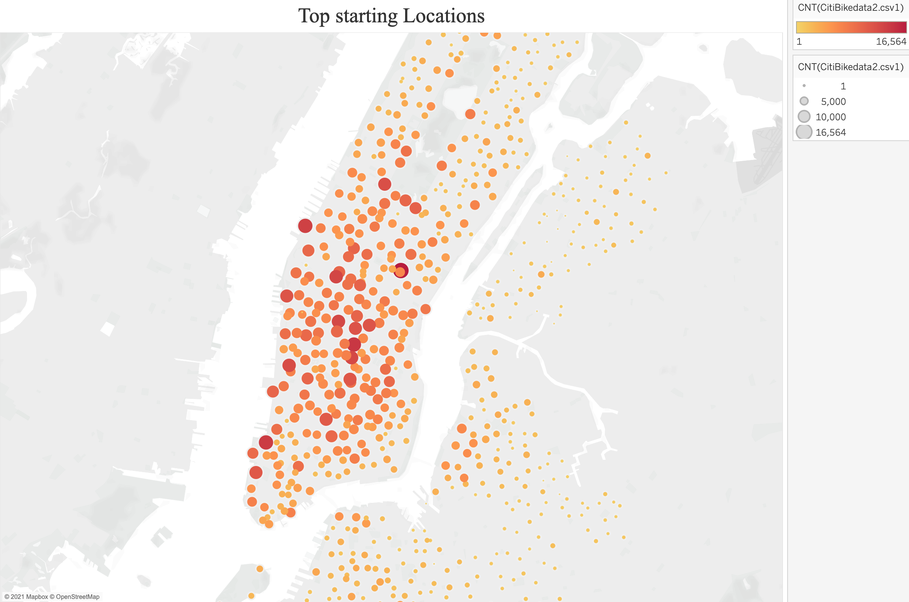

# NYC Citi Bike sharing

## Visualization with Tableau.

## Overview of the analysis: 
The purpose of this analysis is to spin a story with Tableau Visualizations. The Citi Bike is a very popular mode of transport in New York. The data is succesfully visualized and analysed using tableau. Data visualization through Tableau is a very powerful tool to present your story to impress stakeholders who are keen in investing in the company. Data seen visually through Charts and graphs is always better perceived and understood.

## Results:

*Figure 1: Top Starting Location in NYC*

* The start location latitude and longitudes were used to create a scatter plot where the scatter plot size was based on the number of bikes rented out from that location.  
* From the color hues of the scatter, the location that had the maximum dark hue was found to be Manhattan.Manhattan being a very popular spot it is evident that the most number of bikes would be rented out from there.

*Figure 2: Checkout time for users*

* The trip-duration in minutes and the total count of bike users were used to create a line graph with trip-duration in hours used as filters.  
* From the graph, it is evident that most of the bikers (~ 145K) rent the Citi Bike for a maximum time of 5 minutes. This hits hold the point that the most convenient mode of short distance travel is the bike.

*Figure 3: Checkout time in Weekdays by the hour.*

* The starttime in hours and the stoptime are plotted to create a heatmap showing the hours in a weekday during when the Citi Bikes are used the most.  
* The weekdays look busy during the regular office hours. The number of riders start increasing from 7 AM and peaks around 8 AM.  
* Thursdays 8 AM looks the busiest.  
* The rider number again starts to peak around 5 PM - 6 PM , when  the office goers are returning home.  
* Thursdays 5 PM and 6PM looks the busiest.  
* Weekends look to be the opposite of the weekdays where there is activity throughout the day from 10 AM to 7 PM.  
* Saturdays are busier than Sundays.

*Figure 4: Gender Breakdown.*

* Out of the total number of riders (2,344,224) in August, a total of 1,530,272 males and 588,431 females used the bikes to commute.  
* Male riders are 4 times higher than the female riders.  
* In 2019, there were over 3,800 motor vehicle collisions in New York City involving a bicyclist where the cyclist was seriously injured or killed.  
* Since the accidents involving cyclists and motor vehicles are on the rise in NYC, this might be why the women choose not to ride the bike.

*Figure 5: User Trips by gender per weekday*

* Plotting the gender and the usertype of each rider in the weekdays, another heatmap was created.  
* It was earlier seen, that there are two types of users Subscribers and Customers. The subscribers, have a monthly subscription and use the bike daily, whereas the customers use it when and only needed.
* The number of subscribers 1,900,359 are almost 4.5 times higher than the customers 443,865.  
* From the heatmap it is evident that both male and female Subscribers probably ride on fixed routes every weekday trying to optimize their commute time to work.  
* The male subscribers use the bike on weekends too.
* The Customers on the other hand use the Citi Bike more in the weekends than the weekdays.

*Figure 6: Checkout time gender:*

* The trip-duration in minutes and the total count of bike users were used to create a line graph with trip-duration in hours used as filters and genders separated by color.
* A total of 108,087 male riders has a trip duration of about 5 minutes compared to 34,151 female users who used it for a maximum time of 6 minutes.  
* The interesting point is, women ride for longer hours than men.Only 27 men have taken a ride for less than 2 hours.
* A total of 8 women has a trip-duration of 3 hours.

*Figure 7: Trips by gender weekday per hour:*

* Using the starttime and stoptime and filtering by gender another heatmap is created to visualize the usage of bikes based on gender during a typical week.  
* It is evident from the heatmap that about 19,000 to 25,000 male and 7,000 to 8,000 female riders take the Citi Bike mainly for work as the peak hours are 8AM to 9 AM in the morning and the second peak is around 5 PM and 6 PM.  
* In general during the week, Thursday peak hours are busiest.

## Summary:

Citi Bike is a privately owned public bicycle sharing system serving the New York City boroughs of the Bronx, Brooklyn, Manhattan, and Queens, as well as Jersey City, New Jersey.It gained massive popularity in a very short time. From the visualization of the NYC Citi Bike data the following things became evident:  
* The Manhattan area is the most popular location, increasing more bikes in this region will be more profitable for the company and the stakeholders.  
* Biking to work in the weekdays is very popular among men than women. The increasing number of motor vehicle accidents involving bikers could be a reason to keep the female bikers away.  
* More subscribers use the Citi Bike than the customers. The company can look into this and figure out plans to attract more and more customers into riding the bike. Free rides on certain milage can attract people to ride the bike more.  
* The morning and evening checkout time for bikes coincides with the office commute hours, at certain stations, hence the company should make sure that the number of bikes are enough during those times at those stations. Any office rider who doesn't find a bike in stand will be unhappy and tend to move away from biking.

## Two additional visualizations performed with the given dataset.

### Popular locations by name and User types.

*Figure 8: Popular locations by name and usertypes*

* The circle chart shows all the bike locations and their popularity is visualized by the size of the circle. From the chart it is evident that Pershing Square North is the most popular starting location for Male Subscribers. The company needs to make sure that the most popular locations should always be filled with bikes as the riders are the subscribers.

### Average distance in miles travelled by the Subscribers and Customers.

*Figure 9: Average distance in miles travelled by the Subscribers and Customers.*

* Distance in miles is calculated using 3959 * ACOS
(
SIN(RADIANS([Start Station Latitude])) * SIN(RADIANS([End Station Latitude])) +
COS(RADIANS([Start Station Latitude])) * COS(RADIANS([End Station Latitude])) * COS(RADIANS([End Station Longitude]) - RADIANS([Start Station Longitude]))
).  
* From the above graph it is evident that the average distance in miles travelled by Subscribers is high on Tuesdays  and Wednesdays. The Subscribers travel an average distance of 2.5 to 2.8 miles on Tuesdays and Wednesdays.  
* This information is important for the maintenance of the bikes that are used the most.

[link to dashboard](https://public.tableau.com/app/profile/krishnakali.sarkar)
[link to the NYC Challenge dashboard](https://public.tableau.com/app/profile/krishnakali.sarkar/viz/NYCBikeChallenge_16268206355750/NYCCitiBikeStory)
